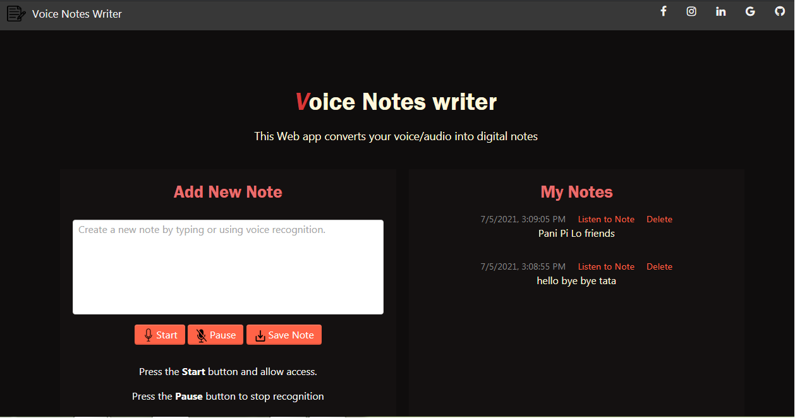
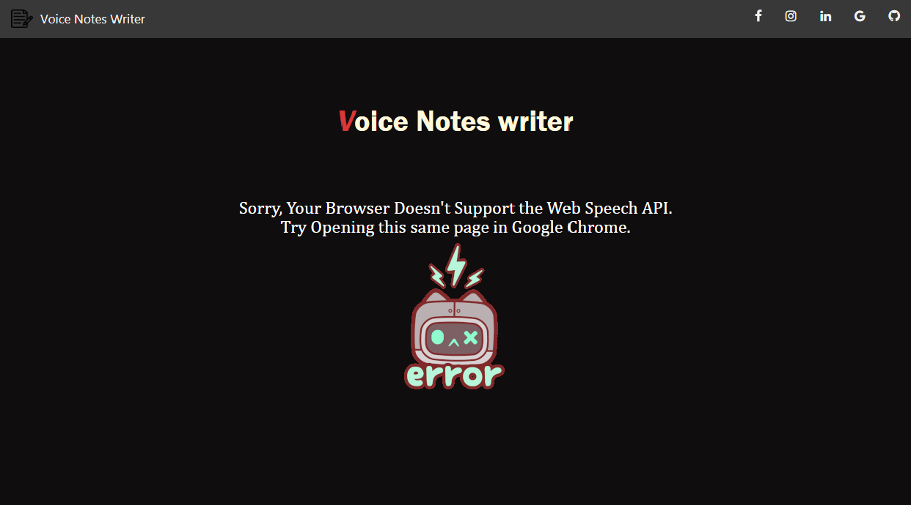

# VNW ( Voice note writer )

#### VNW is a simple javascript based web app that converts your voice/audio to typed notes.
#### VNW works using Web Speech API.

* Working 
> 

* Error page of webapp
> 

Hope you like this :thumbsup: and if you like it make sure to star this repository :star2:.
